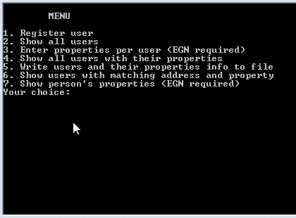

# PeopleAndProperties

PeopleAndProperties is a C++ based small project, demonstrating the basic OO design principles.
  - Class declaration / Object instantiation
  - Constructors/Destructors definition
  - Setters/Getters definition
  - Operator overloading
  - Collections 
  - etc...

Used IDE:  [Microsoft Visual Studio 2013][vs2013]

> Microsoft Visual Studio 2013 Ultimate - 
> Version 12.0.21005.1 REL
> 
> Microsoft .NET Framework -
> Version 4.5.51209


### Version
0.1


### Installation

You need .NET Framework 4.5 installed:

```sh
1. Compile
2. Use the generated PeopleAndProperties.exe file
```

License
----

MIT

   [vs2013]: <https://msdn.microsoft.com/en-us/library/dd831853(v=vs.120).aspx>


